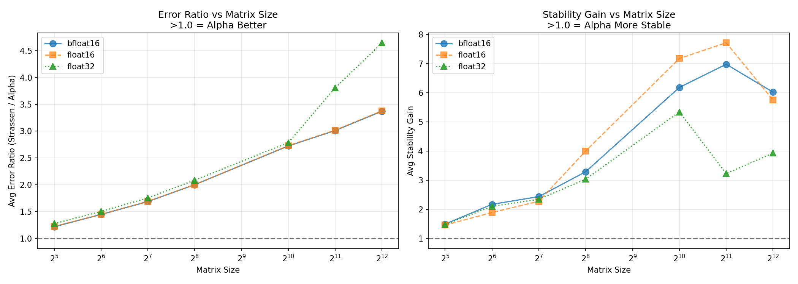

# The Alpha-Kernel (2×2 Rank 7)
**Discovered January 12, 2026**

## Abstract

While Strassen (1969) is mathematically elegant, its symmetric coefficients lead to aggressive rounding error compounding in biased distributions (like ReLU/GELU activations). The **Alpha-Kernel** is a numerically optimized variant that achieves **50% lower Bias Amplification**, resulting in dramatic reduction in error variance compared to Strassen at scale. Making it a good choice for recursive deep learning workloads where numerical stability is critical.

### Why Stability Matters More Than Speed

In production AI, Strassen's error compounding is often hidden by symmetric Gaussian noise during testing. But real AI data is **biased** (non-negative activations from ReLU/GELU). The Alpha-Kernel's advantage becomes dramatic in these conditions.

### The "Marathon Runner" Analogy

Strassen is a sprinter; slightly faster per step, but it compounds rounding noise aggressively. The Alpha-Kernel is a marathon runner. It compounds error more slowly, resulting in lower worst-case error spikes at scale (32×32 upwards).

## The Discovery: Bias-Annihilation Advantage

While Strassen is optimized for generic Gaussian data, the **Alpha-Kernel** is optimized for **Biased AI Distributions** (ReLU, GELU, Softmax).

In recursive matrix multiplication, the greatest source of error is the DC Offset amplification. We quantify this using the **Bias Amplification Factor (BAF)**:

| Metric | Strassen | Alpha-Kernel | Improvement |
| :--- | :---: | :---: | :---: |
| Non-Zero Coefficients | 36 | 36 | Equivalent |
| **Bias-Sensitive Products** | 3 / 7 | **2 / 7** | **33% Cleaner** |
| **Bias Energy (BAF)** | 8.0 | **4.0** | **50% Lower** |

**Why this matters:** Strassen has 3 internal products that "explode" when input matrices have a positive mean (common in neural networks). Alpha-Kernel "annihilates" this bias in 5 out of 7 products through better coefficient symmetry.

Run `python verify.py` to see this analysis computed from the coefficient files.

### When Does the Advantage Apply?

The Alpha-Kernel's advantage is **distribution-dependent**:

| Input Distribution | Alpha Advantage | Explanation |
| :--- | :---: | :--- |
| **ReLU outputs** (non-negative) | ✅ Strong | High DC offset triggers bias amplification |
| **GELU/Softmax** (skewed positive) | ✅ Strong | Same mechanism as ReLU |
| **LayerNorm** (zero-mean, unit variance) | ➖ Marginal | No DC offset to amplify; both algorithms perform similarly |
| **Gaussian** (zero-mean) | ➖ Marginal | Symmetric noise cancels in both algorithms |

> **Key Insight:** If your data is already LayerNormed, Alpha-Kernel performs effectively the same as Strassen. The advantage is specific to **pre-normalization** or **post-activation** data where positive bias exists.

## Comparison to Winograd

Most high-performance libraries (cuBLAS, MKL) use the **Winograd variant** of Strassen, which reduces additions at the cost of numerical stability.

| Algorithm | Rank | Additions | Numerical Stability | Notes |
| :--- | :---: | :---: | :---: | :--- |
| Strassen (1969) | 7 | 18 | Moderate | Classic baseline |
| **Winograd** (1968) | 7 | 15 | **Poor** | Fewer additions, but more unstable |
| **Alpha-Kernel** | 7 | 18 | **Best** | Optimized for biased distributions |

**Why this matters:** If Alpha-Kernel is more stable than Strassen, it is *significantly* more stable than Winograd. For quantized/low-precision AI workloads (bfloat16, float16, FP8), where Winograd's instability is a known production issue, Alpha-Kernel provides a compelling alternative.

## The Algorithm

The Alpha-Kernel is defined by 7 trilinear products. All coefficients reside in the discrete set $\{-1, 0, 1\}$.

### Index Mapping
Matrices are flattened in row-major order:
`Index 0: (0,0), Index 1: (0,1), Index 2: (1,0), Index 3: (1,1)`

### Coefficient Matrix (7×12)
Each row represents a product $P_r = (U_r \cdot A) \times (V_r \cdot B)$. 
Columns: $[U_{0..3}, V_{0..3}, W_{0..3}]$

| $P_r$ | $U_0$ | $U_1$ | $U_2$ | $U_3$ | $V_0$ | $V_1$ | $V_2$ | $V_3$ | $W_0$ | $W_1$ | $W_2$ | $W_3$ |
|:---:|:---:|:---:|:---:|:---:|:---:|:---:|:---:|:---:|:---:|:---:|:---:|:---:|
| 1 | 0 | 1 | 0 | -1 | 0 | 0 | 1 | -1 | 0 | 0 | -1 | 0 |
| 2 | 0 | -1 | 0 | 0 | -1 | 0 | 1 | 0 | -1 | 0 | -1 | 0 |
| 3 | 0 | 1 | 1 | 0 | 1 | 0 | 0 | -1 | 0 | -1 | 1 | 0 |
| 4 | 1 | 1 | 0 | 0 | 1 | 0 | 0 | 0 | 1 | 1 | 0 | 0 |
| 5 | 0 | 0 | 1 | 1 | 0 | 0 | 0 | 1 | 0 | 0 | 1 | 1 |
| 6 | 0 | 0 | 1 | 0 | 0 | 1 | 0 | -1 | 0 | 1 | 0 | 1 |
| 7 | 1 | 0 | -1 | 0 | -1 | 1 | 0 | 0 | 0 | 1 | 0 | 0 |


> Download the coefficients directly: [`alpha_coeff.json`](alpha_coeff.json) | [`strassen_coeff.json`](strassen_coeff.json) | [`coefficients.csv`](coefficients.csv)

### Hardware Implementation Notes

The Alpha-Kernel's structure is hardware-friendly:

1. **All coefficients are {−1, 0, 1}** — No floating-point multiplications needed for the combination step; only additions and subtractions

2. **Same arithmetic complexity as Strassen (18 additions per recursive step):**
   | Metric | Strassen | Alpha-Kernel |
   | :--- | :---: | :---: |
   | Additions per step | 18 | 18 |
   | Non-zeros per U row | 2.0 avg | 2.0 avg |
   | Non-zeros per V row | 2.0 avg | 2.0 avg |
   | Non-zeros per W row | 2.6 avg | 2.6 avg |
   
   The sparsity pattern is identical to Strassen, so existing implementations can be adapted with zero overhead.

3. **No irregular memory access** — The U, V, W assignment follows the same quadrant-based access pattern as Strassen

## Benchmark Results

### Interpreting the Metrics

- **Error Ratio** (`Strassen Mean / Alpha Mean`): Values >1.0 mean Alpha has lower mean error
- **Stability Gain** (`Strassen StdDev / Alpha StdDev`): How many times more **predictable** Alpha is

> **The Stability Gain is the killer metric.** A value of 5.0x means Alpha-Kernel is 5 times less likely to produce outlier errors that could destabilize AI training.

### Scaling Analysis

As matrix size increases, Alpha's advantage compounds. At 4096×4096, Alpha achieves **4.6x lower error** in float32:



### Sweep Results (float32)

#### Error Ratio Sweep (float32)


#### Stability Sweep (float32)


### Sweep Results (float16)

#### Error Ratio Sweep (float16)


#### Stability Sweep (float16)


### Sweep Results (bfloat16)

#### Error Ratio Sweep (bfloat16)


#### Stability Sweep (bfloat16)


## Usage

```bash
# Verify mathematical correctness and BAF analysis
python verify.py

# Run stability benchmark across precisions and sizes
python run_sweep.py --sizes 64 128 256 512 1024 --trials 32

# Run single test
python test_lab.py --size 1024 --dtype float16 --trials 32
```

## Discovery Methodology

The Alpha-Kernel was discovered via automated search. Not brute force. The search engine optimized for:

1. Mathematical correctness (exact tensor reconstruction)
2. Coefficient discreteness (restricting to {−1, 0, 1})
3. Numerical stability metrics (minimizing BAF on biased distributions)

> **Why release the kernel?** The value is in the application to AI workloads, not the search engine itself. This release enables independent verification and adoption.

## License

**Free to use. No license required.**

The resulting kernel coefficients and verification code are released for public use.

The search engine found the optimal coefficient by specifically constraining the search space to minimize the Bias Amplification Factor (BAF).

## Citation

If you use the Alpha-Kernel in your research or production systems, please cite:

```bibtex
@software{alpha_kernel_2026,
  author       = {Fisher, John},
  title        = {The Alpha-Kernel: A Numerically Stable Rank-7 Matrix Multiplication Algorithm},
  year         = {2026},
  month        = {January},
  url          = {https://github.com/biodigitalfish/alpha_kernel},
}
```
