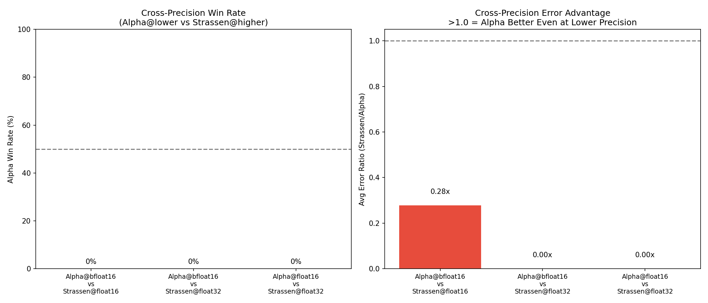

# Cross-Precision Meta-Analysis

**Key Question**: Can Alpha at *lower* precision match or beat Strassen at *higher* precision?

This would demonstrate computational savings - using cheaper precision with Alpha
instead of expensive precision with Strassen.

## Summary

| Comparison | Alpha Wins | Avg Error Ratio | Verdict |
|------------|------------|-----------------|----------|
| Alpha@bfloat16 vs Strassen@bfloat16 | 39/42 (93%) | 2.21x | Baseline |
| Alpha@bfloat16 vs Strassen@float16 | 0/42 (0%) | 0.28x | ❌ Strassen@higher wins |
| Alpha@bfloat16 vs Strassen@float32 | 0/42 (0%) | 0.00x | ❌ Strassen@higher wins |
| Alpha@float16 vs Strassen@float16 | 38/42 (90%) | 2.21x | Baseline |
| Alpha@float16 vs Strassen@float32 | 0/42 (0%) | 0.00x | ❌ Strassen@higher wins |
| Alpha@float32 vs Strassen@float32 | 40/42 (95%) | 2.55x | Baseline |

## Interpretation

📊 **Same-Tier Stability Advantage**

- Alpha's advantage is strongest *within* the same precision tier
- Higher precision still wins over lower precision (as expected mathematically)
- **Key insight**: Within your chosen precision budget, Alpha beats Strassen

### Legend
- **Baseline**: Same-precision comparison (Alpha vs Strassen at equal precision)
- **Avg Error Ratio**: Strassen Error / Alpha Error (>1.0 = Alpha better)

