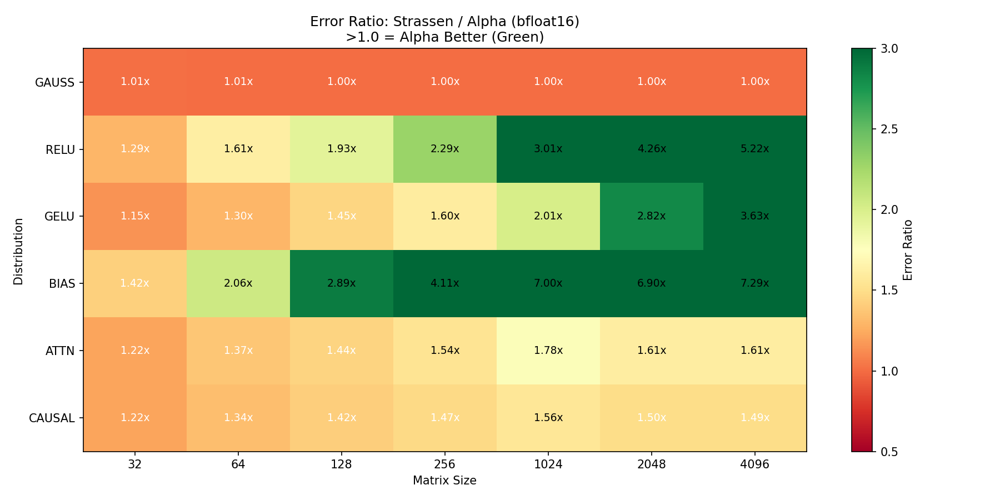
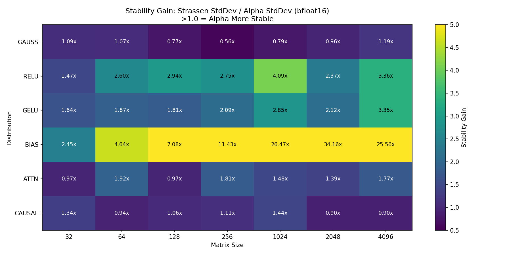
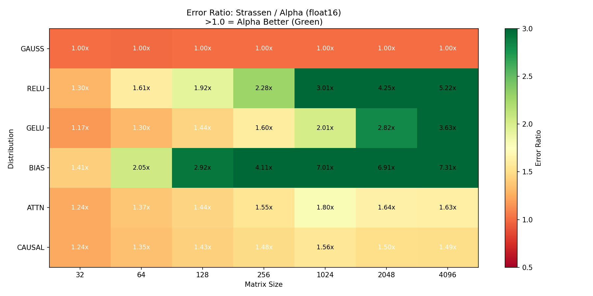
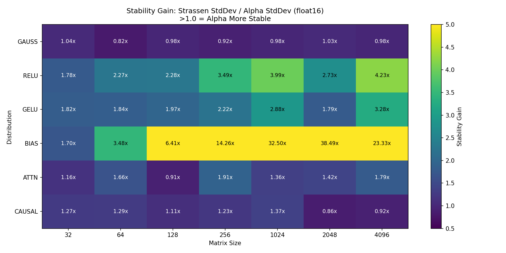
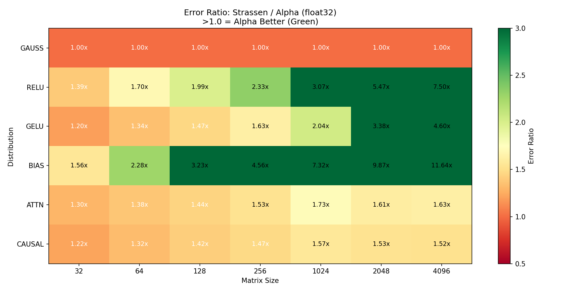
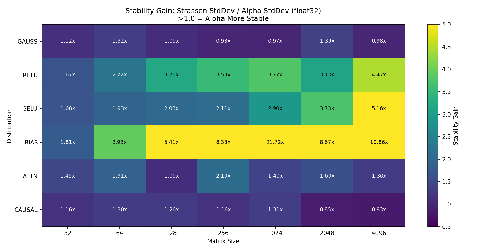

# Alpha-Kernel Sweep Summary

## Key Findings

### BFLOAT16

| Size | Avg Error Ratio | Avg Stability | Alpha Wins |
|------|-----------------|---------------|------------|
| 32 | 1.22x | 1.49x | 6/6 |
| 64 | 1.45x | 2.17x | 6/6 |
| 128 | 1.69x | 2.44x | 5/6 |
| 256 | 2.00x | 3.29x | 6/6 |
| 1024 | 2.73x | 6.19x | 5/6 |
| 2048 | 3.01x | 6.98x | 6/6 |
| 4096 | 3.37x | 6.02x | 5/6 |

### FLOAT16

| Size | Avg Error Ratio | Avg Stability | Alpha Wins |
|------|-----------------|---------------|------------|
| 32 | 1.23x | 1.46x | 6/6 |
| 64 | 1.45x | 1.89x | 5/6 |
| 128 | 1.69x | 2.28x | 6/6 |
| 256 | 2.00x | 4.00x | 5/6 |
| 1024 | 2.73x | 7.18x | 5/6 |
| 2048 | 3.02x | 7.72x | 6/6 |
| 4096 | 3.38x | 5.75x | 5/6 |

### FLOAT32

| Size | Avg Error Ratio | Avg Stability | Alpha Wins |
|------|-----------------|---------------|------------|
| 32 | 1.28x | 1.48x | 6/6 |
| 64 | 1.50x | 2.10x | 6/6 |
| 128 | 1.76x | 2.35x | 6/6 |
| 256 | 2.09x | 3.04x | 6/6 |
| 1024 | 2.79x | 5.35x | 5/6 |
| 2048 | 3.81x | 3.23x | 6/6 |
| 4096 | 4.65x | 3.93x | 5/6 |

## Visualizations

### bfloat16

### float16

### float32

